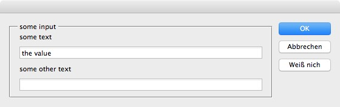
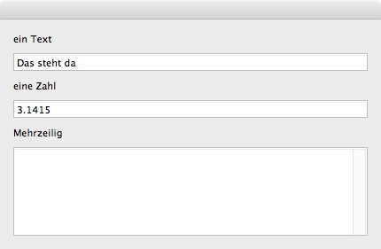
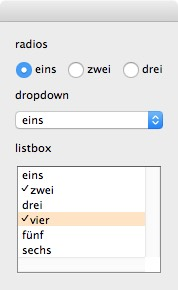
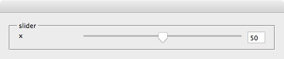
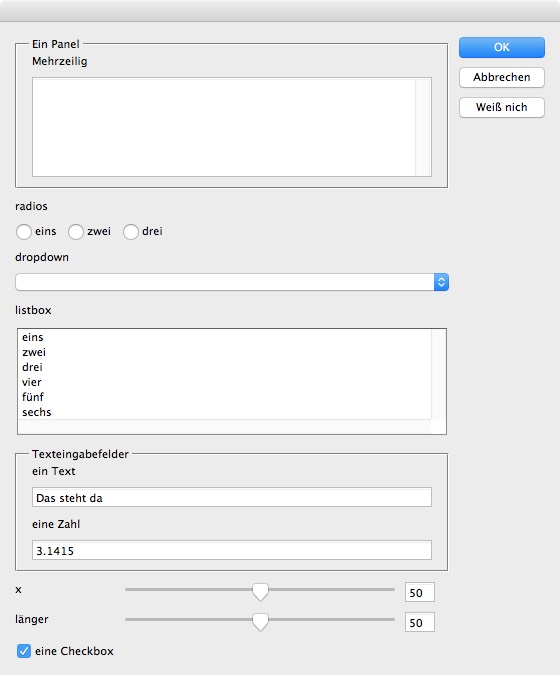

# ScriptUI Scaffolder

This is a script to be run from the ExtendScript Toolkit.

It asks for an *.xml file and creates a *.jsx file from it, containing the ScriptUI elements and their initialisation-code and event handlers.

The syntax of the xml is oriented on HTML form elements. Basically: If you can write HTML-forms you should quickly be able to write ScriptUI forms, too. Currently only a subset of HTML is allowed.

## The tags

### groups and panels

``` xml
<fieldset id="id" orientation="row">...</fieldset>
```

This creates a group.

If you want a panel (i.e. a bordered group with a label), include a `<legend>`:

``` xml
<fieldset id="id">
  <legend>My Panel</legend>
  ...
</fieldset>
```

When you omit the attribute `orientation` the group will be oriented vertically.

This:

``` xml
<?xml version="1.0" ?>
<root>
  <fieldset id="all" orientation="row">
    <fieldset id="main" > 
      <legend>some input</legend>
      <input id="some_text" label="some text">the value</input>
      <input id="some_other_text" label="some other text"></input>
    </fieldset>
    <fieldset valign="top">
      <button id="defaultElement" label="OK" />
      <button id="cancelElement" label="Abbrechen" />
      <button id="weissnich" label="Weiß nich" />
    </fieldset>
  </fieldset>
</root>
```

results in this:



### text input

You have input and textarea.

Formfields must be inside a fieldset.

``` xml
  <fieldset>
    <input id="text_input" label="ein Text">Das steht da</input>
    <input type="number" id="number_input" label="eine Zahl">3.1415</input>
    <textarea id="ta" label="Mehrzeilig" />
  </fieldset>
```

gives



- The default value is the text-child of &lt;input> or &lt;textarea>
- You can specify `type="number"` An event-handler to check the value onChange will be included

### one of n (radiobuttons and select)

I use `<select>` for all n-of-m-selections:

``` xml
  <fieldset id="sel">
    <select id="sel1" label="radios">
      <option>eins</option>
      <option>zwei</option>
      <option>drei</option>
    </select>
  </fieldset>
```

- When your select-node has complex content (i.e. you included some option-tags) and you have no more than 3 options, then you will get radio buttons.
- When you include an attribute `multiple="true"` you will get a listbox that allows multiple selections
- Otherwise you will get a dropdownlist:



### slider

``` xml
<fieldset id="sld">
  <slider id="slider1" label="x" />
</fieldset>
```

I left out the options to set min, max and default in the xml, but you do get the code in the ScriptUI result:

``` javascript
w.slider1.minvalue = 0
w.slider1.maxvalue = 100
w.slider1.value = 50
w.slider1_fd.text = "50"
w.slider1.id = "slider1"
w.state.slider1 = 50
w.slider1.onChange = function() {
  w.slider1_fd.text = this.value
  this.window.state[ this.id ] = this.value
}
w.slider1_fd.onChange = function() {
  if ( ! isNaN( Number( this.text ) ) ) {
    w.slider1.value = Number(this.text)
    w.state.slider1 = Number( this.text)
  } else {
    this.text = w.slider1.value
  }
}
```



A slider has three parts in a row: 
- the label
- the slider
- a text input

the event-handlers to synch slider and textfield should be set up.

### buttons

ScriptUi knows two special buttons: defaultElement (triggered by the Enter key) and cancelElement (triggered by Escape)

``` xml
<fieldset valign="top">
  <button id="defaultElement" label="OK" />
  <button id="cancelElement" label="Abbrechen" />
  <button id="weissnich" label="Weiß nich" />
</fieldset>
```

Set the ID of your `<button>` accordingly.

As usual you will find the event-handlers alongside the button-declaration:

```javascript
// ----------------- group: g0
w.g0 = w.all.add("group", undefined , "")
w.g0.orientation = "column"
w.g0.alignChildren = ["fill", "top"]
// ----------------- button: defaultElement
w.defaultElement = w.g0.add("button", undefined, "OK")
w.defaultElement.onClick= function() {
  this.window.close(1)
  alert("state\n" + this.window.state.toSource() )
}

// ----------------- button: cancelElement
w.cancelElement = w.g0.add("button", undefined, "Abbrechen")
w.cancelElement.onClick= function() {
  this.window.close(2)
}

// ----------------- button: weissnich
w.weissnich = w.g0.add("button", undefined, "Weiß nich")
w.weissnich.onClick = function() {
  // What should happen on Click?
}
```

## Sample

The sample.xml contains all tags in context.

